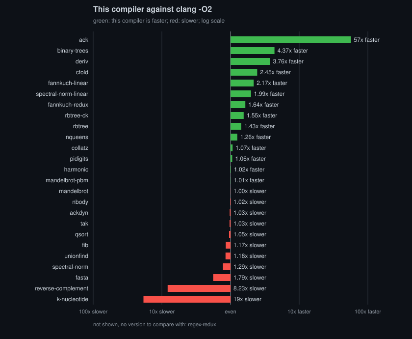
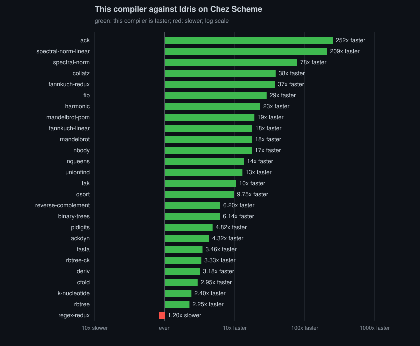
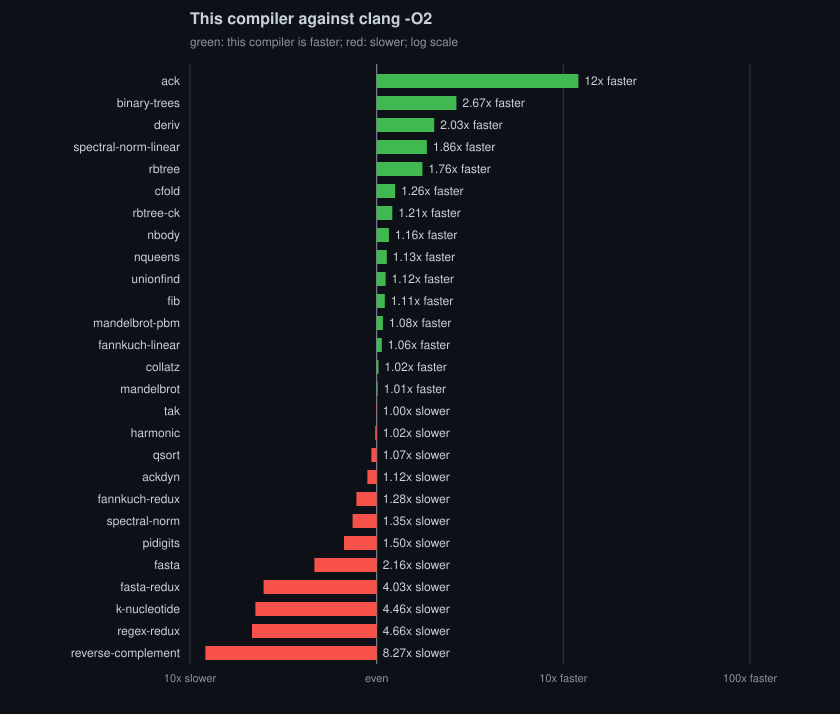
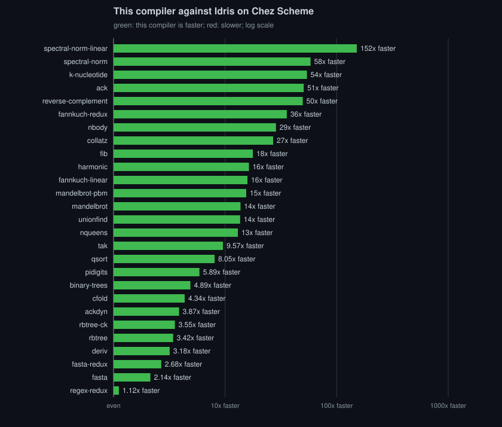

# idris-mlir

An experimental whole-program compiler from unmodified Idris 2 programs over
the stock Prelude and base to native code through MLIR. The goal is high-level code
with guaranteed costs. Where the types promise something (in-place reuse of
linear values, no bounds check), the compiler either
delivers it or rejects the program with a named rule. It is not a Rust
replacement for explicit layout and control, and not merely a faster Idris
backend.

```text
Idris frontend (pinned) → checked TT → Core (Idris: types, monomorphisation, representations)
  → idr dialect (C++) → the simplify loop: inline, specialize, evaluate at compile time
    by running the program's own code in a JIT, to a fixpoint
  → defunctionalize, reference counting, loops → idr-lower → LLVM O3 with the runtime
  → object → linked as the target entry says (static PIE on musl today)
```

Targets: x86_64 Linux (musl, static PIE) today; arm64 macOS is the next
first-class target, and the code is written for both (AGENTS.md). What a
target is lives in one place, its entry in CMakeLists.txt, whose comment
lists every fact an entry gives.

Idris does types; MLIR does programs. Idris checks the program,
monomorphises it and decides each value's representation; everything else
(inlining, specialization, compile-time evaluation, defunctionalization,
reference counting and loops) happens in MLIR. Compile-time
evaluation is runtime evaluation run early: every closed call of pure code
is evaluated by running the program's own lowered code with its own
runtime. As in Idris's own evaluator, totality does not decide what is
evaluated: total code runs to the end, and partial code runs within a
budget, past which the call is left to run at runtime.

## Why not Lean 4

Lean 4 is dependently typed, compiles through precise reference counting
with borrowing and in-place reuse, and ships a production compiler. Our
memory plan ports its passes. What Lean
cannot promise is *when* reuse happens. It tests the count at runtime, so one
extra reference anywhere silently turns an in-place update into a copy.
Koka's fully in-place functions check a function's body statically, but
still decide at runtime whether a call's argument is shared (FP², ICFP 2023).
Idris 2's quantitative type theory states linearity in the types, and this
compiler sees the whole program, so it can prove both halves: the callee
uses the value once, and every caller passes an unshared one. The plan is
to promise the result. A quantity-1 value that is matched and rebuilt at
the same size will be updated in place with no runtime test, or the program
will not compile, with a named reason. The promise will be
carried as ownership types in the `idr` MLIR dialect, and MLIR's verifier
will check it again after every pass instead of trusting the frontend.
Today the counting underneath is in place (below); the static promise is not.
That promise, more than dependent types alone, is why this compiler exists.

## What compiles today

Idris 2 programs over the stock Prelude and base, with `main : IO ()`,
imported explicitly (`--no-prelude` plus `import Prelude`): interfaces
resolved at compile time, `Integer`, `Nat`, `Double`, strings, lists,
`Data.Vect`, base's `IOArray` and `Buffer`, and `System.File` on the
standard streams. Linear arrays and lists come from the compiler's own
`libs/mlir-linear`, plain Idris the stock backend runs unchanged. Values
that remain after the pipeline live in counted cells: `idr-rc` reuses the
cell of a value that dies, borrows what a function only reads, and the
verifier checks after every pass that every reference is consumed exactly
once; cells that never leave their frame are on the stack. A call in tail
position that goes round a cycle of calls is a guaranteed tail call, so a
loop through such calls (a mutual recursion, an IO loop through its binds)
runs in constant stack, as on Chez. With
`IDRIS_RT_LIVE=1` a program reports how many cells are live when it ends:
none. What the compiler cannot compile it rejects with a named rule
(`unsupported (<rule>)`), never miscompiles. The measurements are in
[bench/](bench/README.md).

```sh
idris-mlir --no-prelude --cg mlir -o prog Main.idr
make compile SRC=Main.idr OUT=prog
```

## Performance

Twenty-six programs, each built by this compiler, by Idris's own Chez
Scheme backend, and by clang -O2, measured on 2026-10-03 at 861acdc on an
x86-64 Linux host, best of 5 runs each:





Against clang -O2 on the same algorithm this compiler is faster on 10
programs, within 15% on 9 and slower on 6. The slow ones are mostly
programs written as an Idris programmer writes them first, with
`List Char` where the C has byte buffers (fasta, k-nucleotide,
reverse-complement) and lists where it has arrays (spectral-norm, whose
`Linear.Array` version is 1.99x faster than C). Against Idris on Chez
Scheme 10.4.1 it is faster on 25 of the 26, from 2.25x to 252x; regex-redux
is 1.2x slower.

These are measurements of one shared x86-64 development container (4
CPUs), not of a quiet machine: the run-to-run spread reaches 15%, and the C
column itself moved by up to 2x between days, so each ratio is read
against its own run's C. ack runs in 4 ms; it measures compile-time
specialization.

On arm64 macOS the record is twenty-seven programs, fasta-redux included,
measured by the same command on 2026-10-07 at f5a4dff9 on an Apple M2 Max
(12 CPUs, 16 KiB pages, macOS on AC power; the desktop's own applications
were running), for CPU apple-m1, with the stack at macOS's 64 MiB hard
limit. The game programs are at the size the game measures:





Against clang -O2 it is faster on 8 programs, within 15% on 11 and slower
on 8 (fannkuch-redux, fasta, fasta-redux, k-nucleotide, pidigits,
regex-redux, reverse-complement and spectral-norm); against Idris on Chez
Scheme it is faster on all 27, from 1.12x (regex-redux) to 152x
(spectral-norm-linear). Its
[results](bench/runs/2026-10-07-f5a4dff9-darwin-arm64/results.md) hold
every time and compare each ratio with the previous Mac record's. That
record's
[results](bench/runs/2026-10-05-2cb1436-darwin-arm64/results.md) compare
each ratio with the record before it, whose
[results](bench/runs/2026-10-04-15f1a53-darwin-arm64/results.md) compare
them with the Linux record's: against its own C the Mac is behind on the
allocation-heavy programs (binary-trees, cfold, deriv), on fannkuch-redux
and on pidigits, and ahead on fib, rbtree and reverse-complement; the
Mac's C is the faster of the two by up to 3x (fannkuch-redux's runs in
0.172 s there against 0.546 s), which lowers every ratio against it.

[bench/](bench/README.md) says what each program measures and why each
gap is what it is; the [full results](bench/runs/2026-10-03-861acdc/results.md)
hold every compiler's times, the compile times and the comparison with
the previous run.

## Setup

Prerequisites: Git, Make, a host C/C++ compiler, python3 and m4 (to build
LLVM and GMP), the Linux UAPI headers and coreutils' `timeout`. Chez Scheme
does not come from the host: `make bootstrap` builds the pinned release,
which Idris 2 and the tests' oracle run on, the same on every host. On
Ubuntu 24.04:

```sh
sudo apt-get install -y git make gcc g++ python3 m4 curl linux-libc-dev
```

The scripts run on arm64 macOS too (`tools/host.sh` holds every
difference). There the Command Line Tools give the compiler, the SDK,
Make, Git, python3, m4, curl and perl (whose clock times what `date`
cannot), and MacPorts the rest: coreutils for `gtimeout` and `gsha256sum`:

```sh
xcode-select --install
sudo port install coreutils
```

`make bootstrap` builds the pinned CMake, Ninja, LLVM/MLIR, GMP, Chez
Scheme and Idris 2 into `.toolchain/`; the steps and their environment are
at the top of `tools/bootstrap.sh`. On Linux that is three stages: a
stage-1 clang, musl and the LLVM runtimes, and then a stage-2 LLVM/MLIR,
static on musl and libc++, with LTO. On arm64 macOS it is one stage with
Apple clang, which then builds the pinned runtimes (compiler-rt's builtins
and a static libc++/libc++abi) beside it. The long builds take hours and
tens of GB of disk.
Distribution LLVM packages track release branches, not the pinned commit, so
they are not used.

```sh
git submodule update --init
make doctor                  # what the host has, and what is built
make check                   # the repository: pins, commands, source rules; no build
make bootstrap               # slow: the pinned LLVM/MLIR, musl, GMP, Chez, Idris
make build                   # the C++ dev preset and the compiler
make test                    # compiler, profile, e2e (incl. the Chez diff and the dumps' properties), bench
make test-idr                # the idr dialect, with FileCheck
make test-mlir-tools         # each bug in upstream/ on its reproducer, with the pinned tools
make bench                   # bench/run.sh
```

Everything is installed under `.toolchain/`; `make` alone lists the commands.

## Where a primitive's meaning comes from

The runtime is the one meaning of every primitive; constant folding and
compile-time evaluation call it too. That meaning comes from Idris's own
definition first, then the standard the primitive implements (Unicode,
IEEE 754, POSIX), then a decision of ours written down in
`findings/decision-primitive-semantics.md`. The stock Chez backend is the
test oracle, not the specification: every deliberate difference from it is
a named class in `tests/lib/chez-divergences`.

## Layout

- `compiler/`: the Idris side: frontend, Core, `Emit`.
- `foreign/idr/`: the `idr` dialect, its passes, the JIT and the tools.
- `runtime/`: the runtime every program links, and that folding and
  compile-time evaluation call.
- `libs/`: the Idris packages this compiler ships (`mlir-linear`: linear
  arrays and lists), installed per checkout under `build/idris2`.
- `tests/`: golden tests (`tests/Main.idr`, `tests/README.md`); `bench/`:
  benchmarks against C and Chez.
- `findings/`: decisions taken (`decision-*.md`) and the design notes
  with their ordered work; `findings/README.md` is the map.
- `tools/`: the toolchain's bootstrap and the compile chain;
  `tools/bisect.sh SOURCE TAG` finds the action of TAG (an evaluation, a
  clone) after which a program behaves differently than with `--no-eval`.
- `upstream/`: upstream bugs we carry patches for, each written to be filed.
- `PINS.md`: every pinned workaround and deviation.
- `sources/`: vendored papers, upstream docs and source snapshots.

## License

[0BSD](LICENSE). The Idris 2 dependency keeps its
[upstream license](third_party/Idris2/LICENSE).
