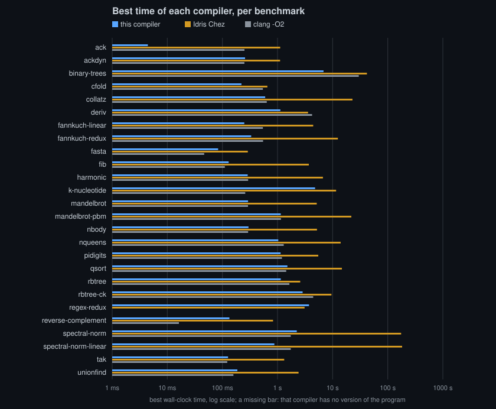
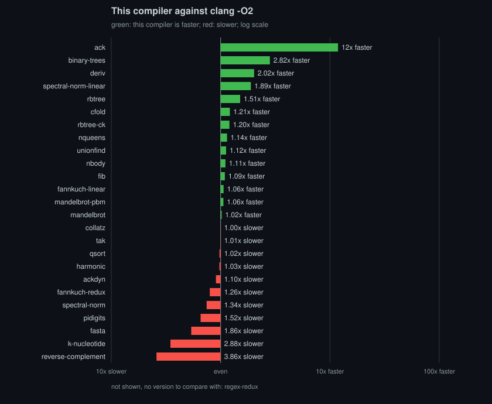
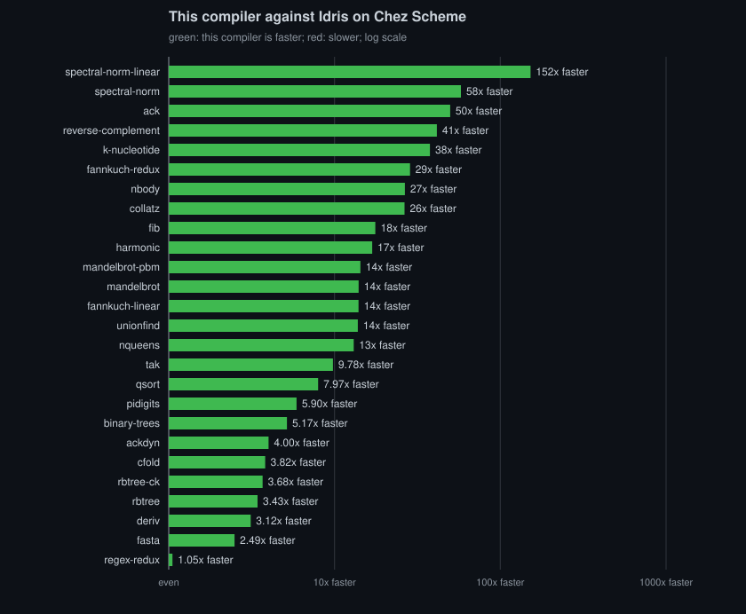
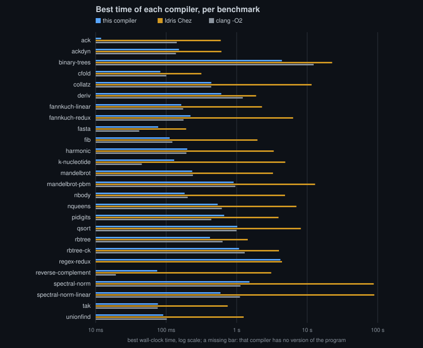

# Benchmarks

`make bench` runs `bench/run.sh`, which builds each program three ways and
runs it on one input (`make bench ARGS='--runs 3 fib tak'` runs fewer):
this compiler on `bench/<name>/Main.idr` (ordinary Idris over the stock
Prelude and base, or over `Linear.Array` of `libs/mlir-linear` where
`bench/<name>/packages` says so); the same source through the stock Chez
backend; and the pinned clang at `-O2` on `bench/c/<name>.c`, linked
as `idris-mlir-cc --print-link-flags` says the target links a program (a
static PIE on musl, a dynamic executable on Darwin), for this
compiler's target CPU without floating-point contraction, as our programs
are built. Every program runs
with the largest stack the system allows: unlimited on Linux, the hard
limit (about 64 MiB) on macOS. Only cfold needs a deep one: its programs
recurse 48 to 56 MiB on x86-64, which fits. The output starts with what it
ran on: the host, its CPU, that stack limit and each compiler's version.

The script checks that the two Idris backends print the same text and that
every program prints the same numbers (to 1e-9), or the same bytes where
the game compares bytes, and reports the best of the runs in wall-clock
seconds, process start included (about a millisecond). The last column is
clang's time over this compiler's: above 1, this compiler is faster.

## Results

The latest record is
[`runs/2026-10-03-861acdc`](runs/2026-10-03-861acdc/results.md): every
program built by every compiler, best of 5 runs, measured on 2026-10-03
at 861acdc on a shared development container (x86-64, 4 CPUs, a Xeon at
2.10 GHz) with LLVM 23.1.2 and Chez Scheme 10.4.1. Its results page holds
the full table, the compile times and the comparison with the record
before it. The arm64 macOS record is beside it, below.

Against clang -O2 this compiler is faster on 10 programs, within 15% on 9
and slower on 6 (fasta, fib, k-nucleotide, reverse-complement,
spectral-norm and unionfind); regex-redux has no C version. Against Idris
on Chez Scheme it is faster on 25 of the 26, from 2.25x (rbtree) to 252x
(ack), and 1.2x slower on regex-redux. Compiling a program takes 1.8 to
11.2 seconds (idris-mlir, idris-mlir-cc and the link); k-nucleotide,
spectral-norm-linear and regex-redux are the slow ones.

Since the record before it (2026-10-02, 903d127): fannkuch-redux went from
0.72x of C to 1.64x (a match knows the case of an enclosing match on its
value), spectral-norm-linear from 0.99x to 1.99x (idr-narrow-lanes' 32-bit
lanes) and reverse-complement from 0.08x to 0.12x; the rest moved within
the spread.

The arm64 macOS record is
[`runs/2026-10-05-2cb1436-darwin-arm64`](runs/2026-10-05-2cb1436-darwin-arm64/results.md):
the same programs and command, best of 5 runs, measured on 2026-10-05 at
2cb1436 on an Apple M2 Max (12 CPUs, 16 KiB pages) on AC power, with the
desktop's own applications running, so not a quiet machine either. This
compiler targets apple-m1 there and links dynamic executables against
libSystem with the host's ld64; clang's C is built for the same CPU and
linked the same way, and the stack is macOS's 64 MiB hard limit, which
cfold fits.

Against clang -O2 it is faster on 7 programs, within 15% on 12 and slower
on 6 (fannkuch-redux, fasta, k-nucleotide, pidigits, reverse-complement
and spectral-norm); against Idris on Chez Scheme it is faster on all 26,
from 1.05x (regex-redux) to 152x (spectral-norm-linear). Compiling a
program takes 1.1 to 16.4 seconds; k-nucleotide is the slow one now, and
why is not measured yet. Its results page
compares each ratio with the previous Mac record's: k-nucleotide, the C's
algorithm since this record, is 0.35x of C (0.130 s against 0.045 s)
where the previous program was 0.01x, and the rest moved within the
spread (rbtree's -23% is clang's C, 0.789 s then and 0.631 s now, ours
0.401 s and 0.418 s). The previous Mac record
([`runs/2026-10-04-15f1a53-darwin-arm64`](runs/2026-10-04-15f1a53-darwin-arm64/results.md))
compares each ratio with the Linux record's, each against its own run's
C: the Mac is behind on the allocation-heavy programs (binary-trees,
cfold, deriv), on fannkuch-redux and on pidigits, and ahead on fib,
rbtree, unionfind and reverse-complement. The Mac's C is the faster of the
two by up to 3x (fannkuch-redux's runs in 0.172 s there against 0.546 s
on Linux), which lowers every ratio against it. ack takes 12 ms here
against Linux's 4 ms; an empty program starts in about 2 ms on this Mac,
so start-up is not all of the difference, and it is not measured further
yet.

How to read them. The run-to-run spread on this container reaches 15%, so
a ratio within that of 1 is parity. The C column itself moved by up to 2x
between runs on different days (rbtree 0.82 s on one, 1.68 s two days
later), so a ratio is read against its own run's C, and records compare by
those ratios, never by seconds. ack runs in 4 ms: it measures the
specialization (Caveats below), not a loop.

A record is what a run measured, kept: `make bench ARGS='--record
bench/runs/<date>-<revision>'` keeps every timed run (`samples.tsv`), the
compile times and what it ran on (`about`), once every output has agreed.
`bench/report.sh RUN PREVIOUS` makes the results page and the charts from
it, and the table `bench/run.sh` prints is that report's, so the numbers
have one source; `tests/bench/records` checks that every kept record's
results are what the report makes. The first record,
`runs/2026-10-02-903d127`, is the table this file held before, transcribed.

Three kinds of program. **Numeric** (ack, ackdyn, collatz, fib, harmonic,
mandelbrot, nbody, tak): Idris over the stock Prelude, whose interfaces,
literals and `show` resolve at compile time and cost nothing. `mandelbrot`
counts points of the set; the game's program is `mandelbrot-pbm`, which
writes the bitmap. **The Benchmarks Game**, below: the ten programs the
game measures now, at the size it measures, plus `fasta-redux` from the
retired set. `fannkuch-linear` and `spectral-norm-linear` are the same two
programs over `Linear.Array`, at the same size. **Counting Immutable
Beans' programs** (rbtree, rbtree-ck, cfold, deriv, nqueens, binary-trees,
qsort, unionfind): the Perceus and Lean papers' benchmarks, written in
Idris from the papers' repositories; qsort and unionfind over
`Linear.Array`. `binary-trees` is both: the game's program, and that
literature's.

### The Benchmarks Game

The ten programs the game measures, and the one retired program added
here. The input is the size the game uses to measure. Each C file is the
single-threaded C entry it follows; where the game's C is threaded, the
table says so. `chameneos-redux` and `thread-ring` are not here: both
require pre-emptive threads (OS threads, or the language's own), and this
compiler has none. `meteor-contest` is not here either. Its board, the
order of the solutions and the limit 2098 are published, and the smallest
solution is the 50-digit string the description prints, but the ten piece
shapes are not on that page. A coordinate list from a later port of the
old solver does not produce that string, so there is no program to add.

| program | input | C entry |
| --- | --- | --- |
| binary-trees | 21 | gcc #1, Kevin Carson. The other C entries are OpenMP or pthreads |
| fannkuch-redux | 12 | gcc #1, the single-threaded count and rotate. gcc #3 (Ledrug Katz) and gcc #8 (Isaac Gouy) are the other single-threaded C entries; gcc #4 is SIMD |
| fasta | 25000000 | gcc #1, a linear search of the cumulative probabilities. The game refuses a scaled lookup; gcc #2, #3 and #8 are that lookup |
| k-nucleotide | fasta 25000000 | no single-threaded C entry. gcc #1 is the only one, and it is OpenMP plus khash. Ours is one core: the sequence packed two bits a nucleotide, counted in an open-addressing table, because a library hash table is what the game asks for and base has none |
| mandelbrot-pbm | 16000 | gcc #8, Greg Buchholz, the single-threaded scalar bitmap. The other C entries are threaded |
| n-body | 50000000 | gcc #1, Christoph Bauer, the symplectic integrator. The C entries are all single-threaded; gcc #4 and #9 add SIMD |
| pidigits | 10000 | gcc #1, GMP, single-threaded. gcc #2 (Oleksii Prudkyi) is the other, also GMP |
| regex-redux | fasta 5000000 | the patterns and the order of gcc #2, Mike Pall, the single-threaded entry. That entry links PCRE; gcc #5 links PCRE2 and is threaded. Ours uses POSIX `regex.h` (macOS libc and musl), and is the slower matcher. No PCRE is pinned |
| reverse-complement | fasta 25000000 | gcc #4, Bob W, single-threaded. gcc #5 (Mr Ledrug) is the other single-threaded C entry; the rest are threaded |
| spectral-norm | 5500 | gcc #8, the only single-threaded C entry. The others are OpenMP |
| fasta-redux | 25000000 | no current C entry; the game no longer measures it. The retired page did not answer here (the live site has no such page, and archive.org did not connect), so the split is the one fasta's own rules still draw: this program indexes a table of every generator residue instead of searching the probabilities. The table is every residue, so the text is fasta's |

`fannkuch-linear` takes 12, like `fannkuch-redux`. `spectral-norm-linear`
takes 5500.

`regex-redux` in Idris carries its own matcher for those patterns: base
has no regex library. The C column calls the system one. The three lengths
are an accumulator: the Prelude's `length` keeps a frame per element, and
the input is longer than the program's stack.

The game's own cutoff for a measured run is several minutes. This suite
kills a run at 300 seconds (times `IDRIS_MLIR_TIME_SCALE`). Scaled from
the Chez column of the 2026-10-05 arm64 record, three official sizes pass
that kill and four do not, and the sizes were not shrunk to hide it:

- `fannkuch-redux` at 12 is about 130 times the work of 10. Chez took
  6.3 s at 10, so about 14 minutes at 12.
- `fannkuch-linear` at 12 is the same factor on Chez's 2.3 s, about the
  300 s kill.
- `k-nucleotide` at fasta 25000000 is 100 times the sequence. Chez took
  4.9 s at 250000, so about 8 minutes.
- `reverse-complement` at fasta 25000000 is the same factor on Chez's
  3.1 s, just past 300 s.

`fasta`, `n-body`, `regex-redux`, `mandelbrot-pbm`, `pidigits`,
`spectral-norm` and `binary-trees` stay under it on that scaling
(`mandelbrot-pbm` at 16000 is about 16 times the pixels of 4000, and Chez
took 13 s there). A later record is what actually happens.

### Per program

- **unionfind** (0.85x of C in the 2026-10-03 record, parity in earlier
  runs): path compression threads the array
  through every `find` and gives it back around a non-tail call. Two
  general changes brought it from 1.4x of C to parity: an array value is
  its cell and its length, so a bounds check compares two registers
  instead of loading the length from the cell, a load LLVM cannot hoist
  past the stores into that cell; and a result a function always returns
  as one of its arguments is dropped after lowering, so `find` returns its
  record in registers and the write after the recursion needs no second
  check. Nothing in the compiler knows union-find.
- **fannkuch-linear** at about 2x of C: the work is the same (the same
  permutations and flips, the same scaling from n=9 to n=11); clang turns
  the C's copy and rotate loops into `memcpy` and `memmove` calls into
  musl, once per permutation, on 40 bytes. Built with `-fno-builtin` the
  same C takes 0.21 s against 0.50 s, then 10 to 15% faster than the
  Idris. The C stays as written. The Idris compiles to the loop's loads and
  stores and nothing else.
- **fannkuch-redux** (`IOArray`) against **fannkuch-linear**: the same
  loops. The table's 3x was the simplify loop's, not the program's:
  inlining base's `readArray` and `writeArray` left each index's range
  test nested in the regions of the same test made for the read before
  it, where nothing folded it, so every test doubled the continuation
  after it, the IO binds on the out-of-bounds paths stayed closures built
  and applied, and the loops became code LLVM would not inline (`rev` was
  a thousand lines after the loop, the linear `rev` 33). A match now
  knows the case of an enclosing match on its value (2026-10-02), and
  both compile to the loops' loads and stores: in one run after the
  change, 0.397 s against the linear version's 0.245 s and C's 0.591 s
  (1.49x and 2.42x of C); in the 2026-10-03 record 0.333 s against the
  linear version's 0.250 s and C's 0.546 s. What remains is base's representation: an
  `IOArray` holds `Maybe elem` cells, an unboxed tag beside each `Int` at
  a stride of 16 bytes, so every read loads and tests a tag and every
  write stores one. The same program over the raw primitive takes the
  same time with Idris's range tests (0.253 s) as without (0.256 s), and
  with the `Maybe` cells alone 0.314 s: the tags are the whole remaining
  gap, the range tests nothing measurable, and `Int` has no spare value
  for `Nothing` that a layout could use. The linear version is filled at
  creation and proved exclusive, so its loops are loads and stores with no
  count changed and nothing allocated (the `linarray-*` and
  `ioarray-fannkuch` fixtures state those properties). There is no
  copying array to turn off: a linear array is mutable by construction on
  every backend. What can be turned off is each compiler mechanism:
- **Ablation.** `idris-mlir-cc --without=STEP,...` (or `--directive
  without=STEP,...` through `idris-mlir`) leaves pipeline steps out, or
  idr-rc's mechanisms (`reuse`, `borrow`, `sink`). fannkuch-linear and
  unionfind, best of 3, each variant compiled and run alone (2026-10-01):

  | left out | fannkuch-linear | unionfind |
  | --- | ---: | ---: |
  | nothing | 0.209 | 0.166 |
  | idr-simplify | 4.770 | 1.484 |
  | sink (consumer sinking in idr-rc) | 0.240 | 0.166 |
  | idr-returned-arguments | 0.201 | 0.241 |
  | reuse (reset/reuse in idr-rc) | 0.211 | 0.215 |
  | idr-stack | 0.199 | 0.215 |
  | idr-tail-loops | 0.214 | 0.197 |
  | idr-defunctionalize | 0.215 | 0.203 |
  | idr-contify | 0.194 | 0.190 |
  | idr-trmc | 0.198 | 0.177 |
  | borrow (borrow inference in idr-rc) | 0.196 | 0.163 |
  | idr-narrow | 0.197 | 0.167 |

  The linear library is plain Idris: `read` and `write` wrap base's array
  primitive in `unsafePerformIO` and rebuild the record through `Res`
  pairs. Without the simplify loop (inlining, specialization, compile-time
  evaluation, the dialect's canonicalizations) fannkuch-linear takes 23x
  longer and unionfind 9x: that is the compiler's work, not the program's.
  After it, consumer sinking is worth 15% on fannkuch (a dup and a drop per
  swap otherwise), and on unionfind the returned argument 1.45x, reuse and
  the stack 1.3x each, the loops 1.2x; the rest is within the spread.
- **spectral-norm** (lists) and **spectral-norm-linear**: the linear one
  is written over `Linear.Array`'s loops over an index space (`generate`,
  `ifoldl`), and idr-vectorize runs each product with A as one loop nest
  computing four rows at a time on AVX2 lanes, each row's sum in index
  order (the C sums in index order too, so clang does not vectorize it).
  The body's index arithmetic is the program's 64-bit `Int`, for which
  x86-64-v3 has no vector multiply nor an int64-to-double conversion: on
  64-bit lanes the inner loop emulates the one (three `vpmuludq`, shifts
  and adds) and scalarizes the other (four `vcvtsi2sd` with the extracts
  and inserts around them), 36 instructions per four rows around the one
  `vdivpd`, which ran at clang's speed. The C computes its indices in
  `int`, for which both instructions exist (`vpmulld`, `vcvtdq2pd`), and
  idr-narrow-lanes gives each row loop a version on 32-bit lanes while n
  is at most 2^14, the bound the analysis of the body's own arithmetic
  finds: 15 instructions per four rows (`vpaddd`, `vpmulld`, a `vpsrad`
  for the `div 2`, `vcvtdq2pd` and the `vdivpd`). Measured at 5500, best
  of 10 interleaved in one session: 0.696 s, against 1.401 s on 64-bit
  lanes and clang's 1.399 s. The 2026-10-03 record shows it in a full run:
  0.874 s against clang's 1.740 s. The list one rebuilds its lists in their own
  cells and pays for it. The input is the game's 5500.
- **qsort** (parity with C): over `Linear.Array`, so the partition writes
  in place.
- **rbtree, rbtree-ck, cfold, deriv, nqueens:** persistent trees and terms
  rebuilt on every step, in the cells of the values that die (reset/reuse),
  as the Perceus and Lean papers' versions do, the rest on the stack.
  rbtree-ck keeps the older trees alive, so it measures the allocator under
  a live set.
- **binary-trees:** the C frees through musl's `malloc`; the game's fastest
  C uses a pool. Ours frees each tree as it dies through the runtime's
  allocator, and the bottom level is one static cell.
- **pidigits:** C uses GMP in place; ours allocates a new `mpz` per
  operation and matches it. The in-place form waits for exclusivity on
  bigs.
- **fasta, reverse-complement:** `List Char` where C has byte buffers, and
  input read a character at a time. Before `pack` built its string once
  (idr.str.pack, 2026-10-02) fasta took 0.38 s of which 0.098 s was
  computation and 0.002 s output, the rest a string per character; it now
  takes about its computation, and reverse-complement 2.8x less than
  before. A line packed only to be written is written as its list is
  walked, without the string (idr.io.put_list, 2026-10-02): about 5% off
  each. What remains is the list itself: a cons cell per character read.
- **k-nucleotide** is the C's algorithm since 2026-10-05: the sequence is an
  `IOArray` of two-bit codes, each fragment a key packed two bits a
  nucleotide and rolled along it with `Data.Bits`, counted in an
  open-addressing table of `IOArray`s whose empty slots (`Nothing`) are the
  unused ones, with the same hash as the C (`key ^ (key >> 15)`). The
  records up to 2026-10-04 measured the earlier program, which counted
  `String`s in a `Data.SortedMap` against the C's hash table; it needed
  `Data.Bits`' shifts on `Int`, which this compiler refused until then.
- **mandelbrot-pbm** builds each row in a `Buffer` and writes it through
  `System.File`, byte for byte as the C does.

## Caveats

- `ack` computes `ack 3 n` with `m` a literal: call-pattern specialization
  copies `ack` with `m` fixed and LLVM closes three of the copies, so this
  measures the specialization; `ackdyn` reads `m` from the input and
  measures deep non-tail recursion.
- `fib`: LLVM turns one of the two recursive calls into a loop, for this
  compiler and clang alike.

## Allocation shapes

`foreign/idr/bench/alloc/` benchmarks the heap traffic of the runtime's
allocation patterns; it chose the allocator, and its README has the
results.
