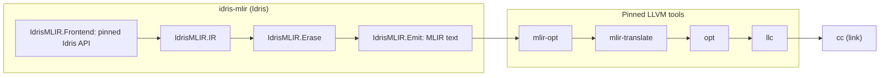

# Architecture

| Module | Role |
| --- | --- |
| `IdrisMLIR.Frontend.Main` | Registers the `mlir` backend with the stock Idris driver |
| `IdrisMLIR.Frontend.Translate` | Checked TT (`treeCT`, signatures) to our IR |
| `IdrisMLIR.IR` | Our typed IR, with binder quantities |
| `IdrisMLIR.Erase` | Deliberate runtime erasure of quantity-0 binders |
| `IdrisMLIR.Emit` | MLIR text in `func`, `arith`, `scf` |

Specialization and representation selection will sit between the IR and
erasure. None of that exists yet.

## Boundaries

- **Idris → our IR.** Only `IdrisMLIR.Frontend.*` imports upstream compiler
  modules; a tooling test enforces this. Everything else consumes our IR, so
  changes to Idris's internal records stay inside the frontend.
- **Our IR → MLIR.** The compiler writes MLIR as text using upstream dialects
  only (`func`, `arith`, `cf`/`scf`, `memref`, `vector`, `llvm`), then the
  pinned tools lower it, as Idris's own backends hand Scheme and C to external
  tools. Today there is no MLIR dialect of our own and no C++. That is a
  default, not a principle: a dialect defined only in text (IRDL) is opaque
  to MLIR's generic passes, so if optimization should happen in MLIR, it
  needs C++. See the [research brief](research/next-research-prompt.md).

## Frontend

The `mlir` backend registers through `mainWithCodegens`. Idris calls its
`incCompileFile` callback after a module checks and before the module's TTC
is written. The callback reads the module's definitions (`toIR defs`) through
`Defs`: signatures and compile-time case trees (`treeCT`), which have not been
erased. It never uses `getIncCompileData`, CExp, or the runtime tree.

The whole-program callback (`compileExpr`, used by `-o`) is not implemented.
Idris hands it `unsafePerformIO main`, so it needs IO lowering first. Until
then each module is compiled on its own, and a zero-argument `main : Int` is
the entry point.

An unchanged module skips the callback. An import without our incremental
data makes Idris drop `mlir` from its incremental backends, so an ordinary
prebuilt Prelude silently disables it. Cached imports also lose information
that fresh modules have: TTC omits runtime case trees and the types of
machine-generated names.

## Semantic rules

Keep constants, erased symbolic indices, and runtime indices distinct: erased
does not mean constant. A multiplicity-one binder does not imply unique heap
ownership. `Vect` does not imply contiguous storage, and `Nat` does not imply
a machine word. Preserve evaluation order and laziness. When the supported
subset cannot justify a lowering, fail explicitly.

Fixed-width integer arithmetic wraps (two's complement), which is how Idris's
Chez and RefC backends behave; `BitsN` comparisons and widening are unsigned.
