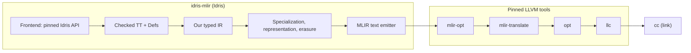

# Architecture

Only the frontend adapter exists today. The typed IR, passes, emitter, and
runtime are not implemented.

## Boundaries

- **Idris → our IR.** Only `IdrisMLIR.Frontend.*` imports upstream compiler
  modules; a tooling test enforces this. Everything else consumes our IR, so
  changes to Idris's internal records stay inside the adapter.
- **Our IR → MLIR.** The compiler writes MLIR as text using upstream dialects
  only (`func`, `arith`, `cf`/`scf`, `memref`, `vector`, `llvm`), then shells
  out to the pinned tools, as Idris's own backends do with Scheme and C. We
  maintain no MLIR dialect and no C++. Idris-specific structure (constructors,
  closures, laziness) is lowered in our passes before emission.

## Frontend

The `core-inspect` backend registers through `mainWithCodegens`. Idris calls
its `incCompileFile` callback after a module checks successfully and before
the module's TTC is written; it reads checked definitions through `Defs`
(`toIR defs`) and never through `getIncCompileData` or CExp. The later
whole-program `compileExpr` callback will be the entry point for emitting MLIR.

An unchanged module skips the callback. An import without our incremental
data makes Idris drop `core-inspect` from its incremental backends, so an
ordinary prebuilt Prelude silently disables it. Tests therefore use a
no-Prelude fixture. Cached imports also lose information that fresh modules
have: TTC omits runtime case trees and the types of machine-generated names.
Measuring fresh versus cached inspection comes before defining the typed IR.

## Semantic rules

Keep constants, erased symbolic indices, and runtime indices distinct: erased
does not mean constant. A multiplicity-one binder does not imply unique heap
ownership. `Vect` does not imply contiguous storage, and `Nat` does not imply
a machine word. Preserve evaluation order and laziness. When the supported
subset cannot justify a lowering, fail explicitly.
